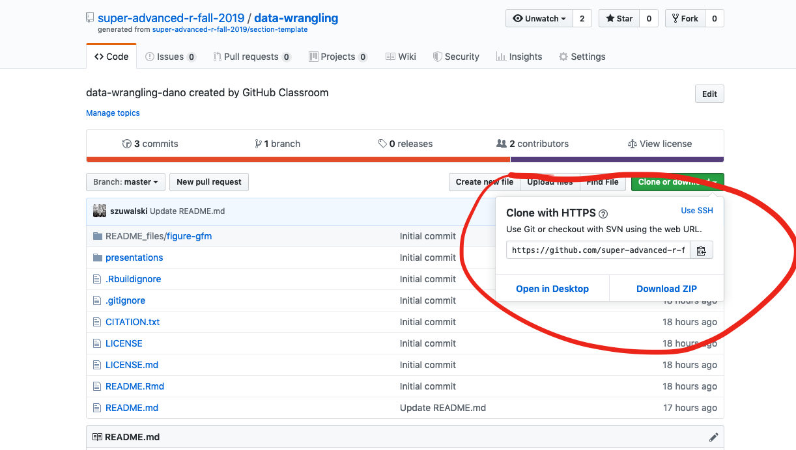

```{r, include = FALSE}
knitr::opts_chunk$set(
  collapse = TRUE,
  comment = "#>"
)
```
## [Steller sea lion demography & environmental variability](link)

#### Journal name

#### Amanda J. Warlick, Devin Johnson, Sarah J. Converse

##### Code DOI: [

##### Please contact the first author for questions about the code or data: Amanda J. Warlick (awarlick@uw.edu)
_______________________________________________________________________________________________________

## Abstract:
1. 
2. 
3. 
4. 

### Repository Directory

#### [Published PDF](link)

### [scripts](./scripts)

Contains code for running models and analyzing results. 

### Data

Contains raw and processed data: [data](./data) 

### Results

Contains figures and results: [results](./results)


<!-- This repository contains materials for the manuscript X.  -->

<!-- Data can be found in this Dryad repository.  [here](link) -->


<!--  -->

